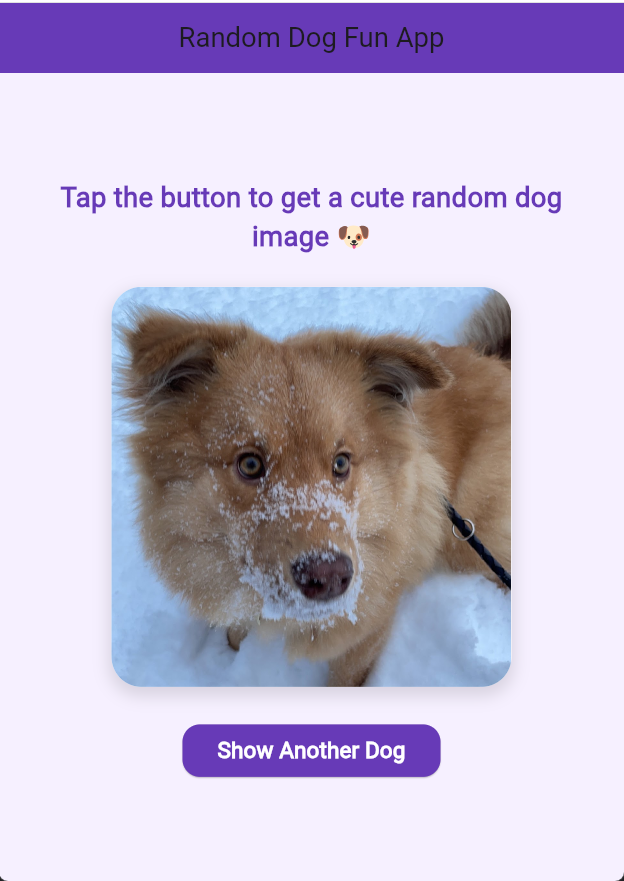
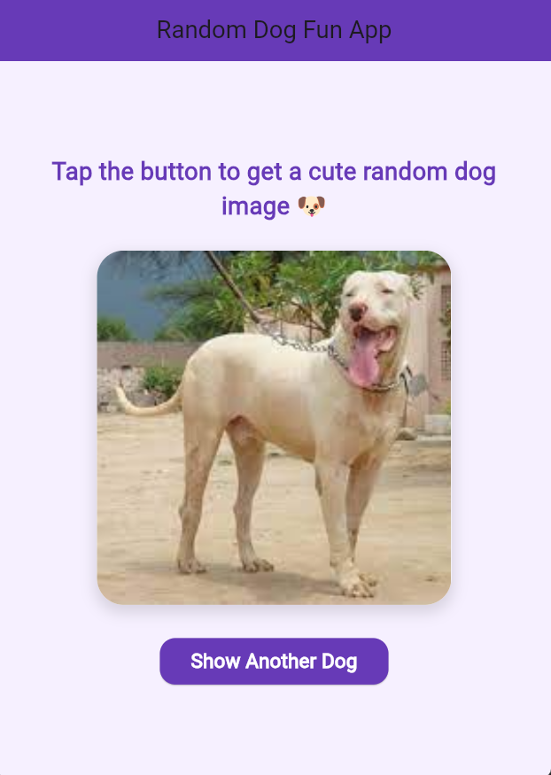
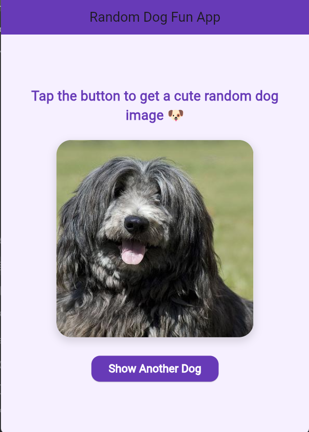

# Assignment 4 - Creative Use of Packages

This Flutter project is a fun random dog image app built using an external package from pub.dev.

## Package Used
- http

## What the app does
- Fetches a random dog image from an online API
- Displays the image in a styled container
- Allows the user to load another image by pressing a button
- Shows loading and error states

## Interactive Feature
The user can tap the button to fetch a new random dog image dynamically.

## API Used
- https://dog.ceo/api/breeds/image/random
- 
## Screenshots

